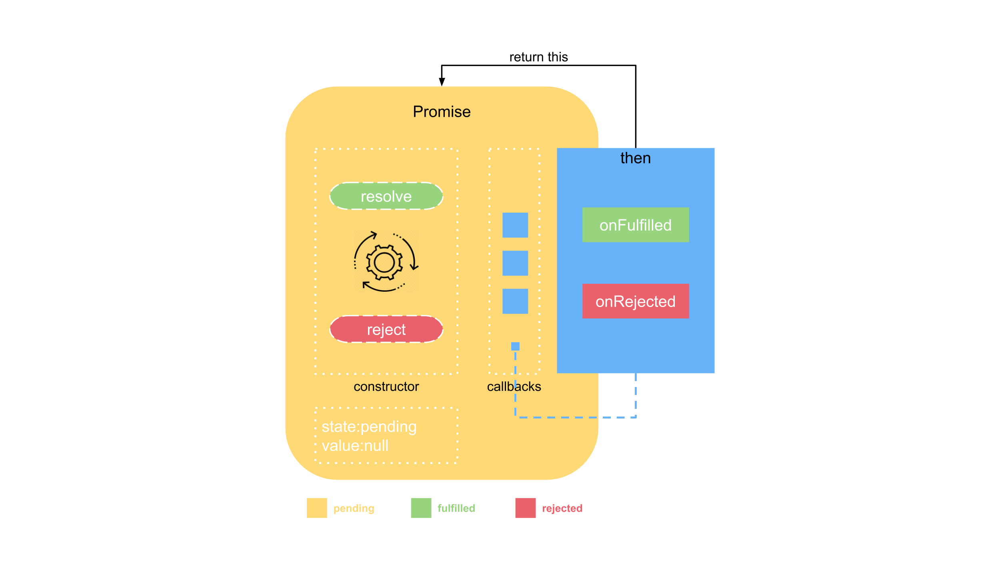

# 图解 Promise 实现原理（一）—— 基础实现

## 摘要

很多同学在学习 Promise 时，知其然却不知其所以然，对其中的用法理解不了。**本系列文章由浅入深逐步实现 Promise，并结合流程图、实例以及动画进行演示，达到深刻理解 Promise 用法的目的。**

1. [图解 Promise 实现原理（一）—— 基础实现](./README.md)
2. [图解 Promise 实现原理（二）—— Promise 链式调用](../chapter02/README.md)
3. [图解 Promise 实现原理（三）—— Promise 原型方法实现](../chapter03/README.md)
4. [图解 Promise 实现原理（四）—— Promise 静态方法实现](../chapter04/README.md)

## 前言

本文适合对 Promise 的用法有所了解的人阅读，如果还不清楚，请自行查阅阮一峰老师的 [ES6入门 之 Promise 对象](https://es6.ruanyifeng.com/#docs/promise)
Promise 规范有很多，如 Promise/A，Promise/B，Promise/D 以及 Promise/A 的升级版 Promise/A+，有兴趣的可以去了解下，最终 ES6 中采用了 Promise/A+ 规范。所以本文的 Promise 源码是按照 [Promise/A+](https://promisesaplus.com/) 规范来编写的（不想看英文版的移步 [Promise/A+ 规范中文翻译](https://www.ituring.com.cn/article/66566)）

为了让大家更容易理解，我们从一个场景开始，一步一步跟着思路思考，会更容易看懂。

考虑下面一种获取用户 id 的请求处理：

```js
//不使用Promise        
http.get('some_url', function (result) {
    //do something
    console.log(result.id);
});

//使用Promise
new Promise(function (resolve) {
    //异步请求
    http.get('some_url', function (result) {
        resolve(result.id)
    })
}).then(function (id) {
    //do something
    console.log(id);
})
```

乍一看，好像不使用 Promise 更简洁一些。其实不然，设想一下，如果有好几个依赖的前置请求都是异步的，此时如果没有 Promise ，那回调函数要一层一层嵌套，看起来就很不舒服了。如下：

```js
//不使用Promise        
http.get('some_url', function (id) {
    //do something
    http.get('getNameById', id, function (name) {
        //do something
        http.get('getCourseByName', name, function (course) {
            //dong something
            http.get('getCourseDetailByCourse', function (courseDetail) {
                //do something
            })
        })
    })
});

//使用Promise
function getUserId(url) {
    return new Promise(function (resolve) {
        //异步请求
        http.get(url, function (id) {
            resolve(id)
        })
    })
}
getUserId('some_url').then(function (id) {
    //do something
    return getNameById(id); // getNameById 是和 getUserId 一样的Promise封装。下同
}).then(function (name) {
    //do something
    return getCourseByName(name);
}).then(function (course) {
    //do something
    return getCourseDetailByCourse(course);
}).then(function (courseDetail) {
    //do something
});
```

## 实现原理

说到底，Promise 也还是使用回调函数，只不过是把回调封装在了内部，使用上一直通过 then 方法的链式调用，使得多层的回调嵌套看起来变成了同一层的，书写上以及理解上会更直观和简洁一些。

**一、基础版本**

```js
//极简的实现
class Promise {
    callbacks = [];
    constructor(fn) {
        fn(this._resolve.bind(this));
    }
    then(onFulfilled) {
        this.callbacks.push(onFulfilled);
    }
    _resolve(value) {
        this.callbacks.forEach(fn => fn(value));
    }
}

//Promise应用
let p = new Promise(resolve => {
    setTimeout(() => {
        console.log('done');
        resolve('5秒');
    }, 5000);
}).then((tip) => {
    console.log(tip);
})
```

上述代码很简单，大致的逻辑是这样的：

1. 调用 then 方法，将想要在 Promise 异步操作成功时执行的 onFulfilled 放入callbacks队列，其实也就是注册回调函数，可以向观察者模式方向思考；

2. 创建 Promise 实例时传入的函数会被赋予一个函数类型的参数，即 resolve，它接收一个参数 value，代表异步操作返回的结果，当异步操作执行成功后，会调用resolve方法，这时候其实真正执行的操作是将 callbacks 队列中的回调一一执行；


首先 new Promise 时，传给 Promise 的函数设置定时器模拟异步的场景，接着调用 Promise 对象的 then 方法注册异步操作完成后的 onFulfilled，最后当异步操作完成时，调用 resolve(value)， 执行 then 方法注册的 onFulfilled。

then 方法注册的 onFulfilled 是存在一个数组中，可见 then 方法可以调用多次，注册的多个 onFulfilled 会在异步操作完成后根据添加的顺序依次执行。如下：

```js
//then 的说明
let p = new Promise(resolve => {
    setTimeout(() => {
        console.log('done');
        resolve('5秒');
    }, 5000);
});

p.then(tip => {
    console.log('then1', tip);
});

p.then(tip => {
    console.log('then2', tip);
});
```

上例中，要先定义一个变量 p ，然后 p.then 两次。而规范中要求，then 方法应该能够链式调用。**实现也简单，只需要在 then 中 return this 即可**。如下所示：

```js
//极简的实现+链式调用
class Promise {
    callbacks = [];
    constructor(fn) {
        fn(this._resolve.bind(this));
    }
    then(onFulfilled) {
        this.callbacks.push(onFulfilled);
        return this;//看这里
    }
    _resolve(value) {
        this.callbacks.forEach(fn => fn(value));
    }
}

let p = new Promise(resolve => {
    setTimeout(() => {
        console.log('done');
        resolve('5秒');
    }, 5000);
}).then(tip => {
    console.log('then1', tip);
}).then(tip => {
    console.log('then2', tip);
});
```


**二、加入延迟机制**

上面 Promise 的实现存在一个问题：如果在 then 方法注册 onFulfilled 之前，resolve 就执行了，onFulfilled 就不会执行到了。比如上面的例子中我们把 setTimout 去掉：

```js
//同步执行了resolve
let p = new Promise(resolve => {
    console.log('同步执行');
    resolve('同步执行');
}).then(tip => {
    console.log('then1', tip);
}).then(tip => {
    console.log('then2', tip);
});
```

执行结果显示，只有 "同步执行" 被打印了出来，后面的 "then1" 和 "then2" 均没有打印出来。再回去看下 Promise 的源码，也很好理解，resolve 执行时，callbacks 还是空数组，还没有 onFulfilled 注册上来。

这显然是不允许的，Promises/A+ 规范明确要求回调需要通过异步方式执行，用以保证一致可靠的执行顺序。因此要加入一些处理，保证在 resolve 执行之前，then 方法已经注册完所有的回调：

```js
//极简的实现+链式调用+延迟机制
class Promise {
    callbacks = [];
    constructor(fn) {
        fn(this._resolve.bind(this));
    }
    then(onFulfilled) {
        this.callbacks.push(onFulfilled);
        return this;
    }
    _resolve(value) {
        setTimeout(() => {//看这里
            this.callbacks.forEach(fn => fn(value));
        });
    }
}
```

在 resolve 中增加定时器，通过 setTimeout 机制，将 resolve 中执行回调的逻辑放置到JS任务队列末尾，以保证在 resolve 执行时，then 方法的 onFulfilled 已经注册完成。


但是这样依然存在问题，在 resolve 执行后，再通过 then 注册上来的 onFulfilled 都没有机会执行了。如下所示，我们加了延迟后，then1 和 then2 可以打印出来了，但下例中的 then3 依然打印不出来。所以我们需要增加状态，并且保存 resolve 的值。

```js
let p = new Promise(resolve => {
    console.log('同步执行');
    resolve('同步执行');
}).then(tip => {
    console.log('then1', tip);
}).then(tip => {
    console.log('then2', tip);
});

setTimeout(() => {
    p.then(tip => {
        console.log('then3', tip);
    })
});
```

**三、增加状态**

为了解决上一节抛出的问题，我们必须加入状态机制，也就是大家熟知的 pending、fulfilled、rejected。

Promises/A+ 规范中明确规定了，pending 可以转化为 fulfilled 或 rejected 并且只能转化一次，也就是说如果 pending 转化到 fulfilled 状态，那么就不能再转化到 rejected。并且 fulfilled 和 rejected 状态只能由 pending 转化而来，两者之间不能互相转换。


增加状态后的实现是这样的

```js
//极简的实现+链式调用+延迟机制+状态
class Promise {
    callbacks = [];
    state = 'pending';//增加状态
    value = null;//保存结果
    constructor(fn) {
        fn(this._resolve.bind(this));
    }
    then(onFulfilled) {
        if (this.state === 'pending') {//在resolve之前，跟之前逻辑一样，添加到callbacks中
            this.callbacks.push(onFulfilled);
        } else {//在resolve之后，直接执行回调，返回结果了
            onFulfilled(this.value);
        }
        return this;
    }
    _resolve(value) {
        this.state = 'fulfilled';//改变状态
        this.value = value;//保存结果
        this.callbacks.forEach(fn => fn(value));
    }
}
```

> **注意** 当增加完状态之后，原先的_resolve中的定时器可以去掉了。当reolve同步执行时，虽然callbacks为空，回调函数还没有注册上来，但没有关系，因为后面注册上来时，判断状态为fulfilled，会立即执行回调。



> 实现源码中只增加了 fulfilled 的状态 和 onFulfilled 的回调，但为了完整性，在示意图中增加了 rejected 和 onRejected 。后面章节会实现。

resolve 执行时，会将状态设置为 fulfilled ，并把 value 的值存起来，在此之后调用 then 添加的新回调，都会立即执行，直接返回保存的value值。

来看一下演示动画，随着代码一行一行的执行，实际发生了什么：


至此，一个初具功能的Promise就实现好了，它实现了 then，实现了链式调用，实现了状态管理等等。但仔细想想，链式调用的实现只是在 then 中 return 了 this，因为是同一个实例，调用再多次 then 也只能返回相同的一个结果，这显然是不能满足我们的要求的。下一节，讲述如何实现真正的链式调用。

[图解 Promise 实现原理（二）—— Promise 链式调用](../chapter02/README.md)


