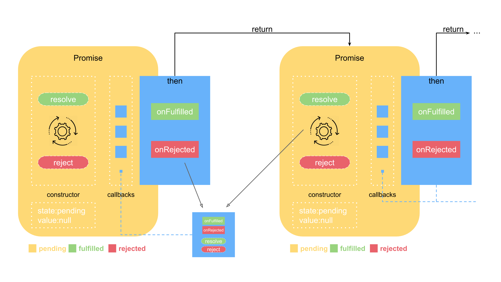
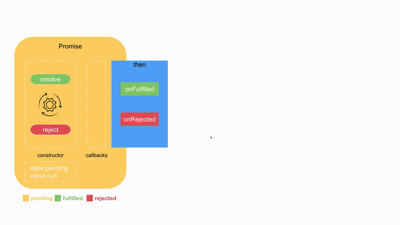
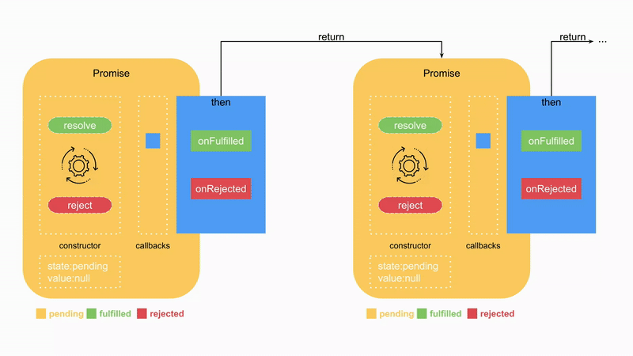
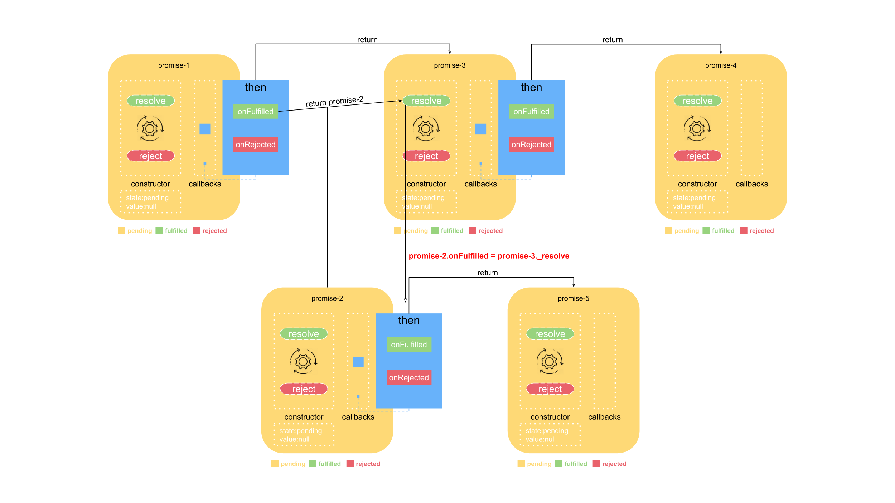

# 图解 Promise 实现原理（二）—— Promise 链式调用

## 摘要

很多同学在学习 Promise 时，知其然却不知其所以然，对其中的用法理解不了。**本系列文章由浅入深逐步实现 Promise，并结合流程图、实例以及动画进行演示，达到深刻理解 Promise 用法的目的。**

1. [图解 Promise 实现原理（一）—— 基础实现](../chapter01/README.md)
2. [图解 Promise 实现原理（二）—— Promise 链式调用](./README.md)
3. [图解 Promise 实现原理（三）—— Promise 原型方法实现](../chapter03/README.md)
4. [图解 Promise 实现原理（四）—— Promise 静态方法实现](../chapter04/README.md)

## 前言

上一节中，实现了 Promise 的基础版本：

```js
//极简的实现+链式调用+延迟机制+状态
class Promise {
    callbacks = [];
    state = 'pending';//增加状态
    value = null;//保存结果
    constructor(fn) {
        fn(this._resolve.bind(this));
    }
    then(onFulfilled) {
        if (this.state === 'pending') {//在resolve之前，跟之前逻辑一样，添加到callbacks中
            this.callbacks.push(onFulfilled);
        } else {//在resolve之后，直接执行回调，返回结果了
            onFulfilled(this.value);
        }
        return this;
    }
    _resolve(value) {
        this.state = 'fulfilled';//改变状态
        this.value = value;//保存结果
        this.callbacks.forEach(fn => fn(value));
    }
}
```

但链式调用，只是在 then 方法中 return 了 this，使得 Promise 实例可以多次调用 then 方法，但因为是同一个实例，调用再多次 then 也只能返回相同的一个结果，通常我们希望的链式调用是这样的：

```js
//使用Promise
function getUserId(url) {
    return new Promise(function (resolve) {
        //异步请求
        http.get(url, function (id) {
            resolve(id)
        })
    })
}
getUserId('some_url').then(function (id) {
    //do something
    return getNameById(id);
}).then(function (name) {
    //do something
    return getCourseByName(name);
}).then(function (course) {
    //do something
    return getCourseDetailByCourse(course);
}).then(function (courseDetail) {
    //do something
});
```

每个 then 注册的 onFulfilled 都返回了不同的结果，层层递进，很明显在 then 方法中 return this 不能达到这个效果。引入真正的链式调用，**then 返回的一定是一个新的Promise实例**。



真正的链式 Promise 是指在当前 Promise 达到 fulfilled 状态后，即开始进行下一个 Promise（后邻 Promise）。那么我们如何衔接当前 Promise 和后邻 Promise 呢？（这是理解 Promise 的难点，我们会通过动画演示这个过程）。

## 链式调用的实现

先看下实现源码：

```js
//完整的实现
class Promise {
    callbacks = [];
    state = 'pending';//增加状态
    value = null;//保存结果
    constructor(fn) {
        fn(this._resolve.bind(this));
    }
    then(onFulfilled) {
        return new Promise(resolve => {
            this._handle({
                onFulfilled: onFulfilled || null,
                resolve: resolve
            });
        });
    }
    _handle(callback) {
        if (this.state === 'pending') {
            this.callbacks.push(callback);
            return;
        }
        //如果then中没有传递任何东西
        if (!callback.onFulfilled) {
            callback.resolve(this.value);
            return;
        }
        var ret = callback.onFulfilled(this.value);
        callback.resolve(ret);
    }
    _resolve(value) {
        this.state = 'fulfilled';//改变状态
        this.value = value;//保存结果
        this.callbacks.forEach(callback => this._handle(callback));
    }
}
```

由上面的实现，我们可以看到：

- **then 方法中，创建并返回了新的 Promise 实例，这是串行Promise的基础，是实现真正链式调用的根本**
- **then 方法传入的形参 onFulfilled 以及创建新 Promise 实例时传入的 resolve 放在一起，被push到当前 Promise 的 callbacks 队列中，这是衔接当前 Promise 和后邻 Promise 的关键所在**
- **根据规范，onFulfilled 是可以为空的，为空时不调用 onFulfilled**

看下动画演示：



当第一个 Promise 成功时，resolve 方法将其状态置为 fulfilled ，并保存 resolve 带过来的value。然后取出 callbacks 中的对象，执行当前 Promise的 onFulfilled，返回值通过调用第二个 Promise 的 resolve 方法，传递给第二个 Promise。动画演示如下：



为了真实的看到链式调用的过程，我写一个mockAjax函数，用来模拟异步请求：

```js
/**
 * 模拟异步请求
 * @param {*} url  请求的URL
 * @param {*} s  指定该请求的耗时，即多久之后请求会返回。单位秒
 * @param {*} callback 请求返回后的回调函数
 */
const mockAjax = (url, s, callback) => {
    setTimeout(() => {
        callback(url + '异步请求耗时' + s + '秒');
    }, 1000 * s)
}
```

除此之外，我给 Promise 的源码加上了日志输出并增加了构造顺序标识，可以清楚的看到构造以及执行过程：

```js
//Demo1
new Promise(resolve => {
  mockAjax('getUserId', 1, function (result) {
    resolve(result);
  })
}).then(result => {
  console.log(result);
})
```

[Demo1的源码](https://repl.it/@morrain2016/Demo1)

执行结果如下：

```
[Promse-1]:constructor
[Promse-1]:then
[Promse-2]:constructor
[Promse-1]:_handle state= pending
[Promse-1]:_handle callbacks= [ { onFulfilled: [Function], resolve: [Function] } ]
=> Promise { callbacks: [], name: 'Promse-2', state: 'pending', value: null }
[Promse-1]:_resolve
[Promse-1]:_resolve value= getUserId异步请求耗时1秒
[Promse-1]:_handle state= fulfilled
getUserId异步请求耗时1秒
[Promse-2]:_resolve
[Promse-2]:_resolve value= undefined
```

通过打印出来的日志，可以看到:

1. 构造 Promise-1 实例，立即执行 mackAjax('getUserId',callback);
2. 调用 Promise-1 的 then 方法，注册 Promise-1 的 onFulfilled 函数。
3. then 函数内部构造了一个新的 Promise实例：Promise-2。立即执行 Promise-1 的 _handle方法
4. 此时 Promise-1 还是pending的状态
5. Promise-1._handle 中就把注册在 Promise-1 的 onFulfilled 和 Promise-2 的 resolve 保存在 Promise-1 内部的 callbacks
6. 至此当前线程执行结束。返回的是 Promise-2 的 Promise实例。
7. 1s后，异步请求返回，要改变 Promise-1 的状态和结果，执行 resolve(result)
8. Promise-1 的值被改变，内容为异步请求返回的结果："getUserId异步请求耗时1s"
9. Promise-1 的状态变成 fulfilled
10. Promise-1 的 onFulfilled 被执行，打印出了"getUserId异步请求耗时1秒"
11. 然后再调用 Promise-2.resolve
12. 改变 Promise-2 的值和状态，因为 Promise-1 的 onFulfilled 没有返回值，所以 Promise-2的值为undefined

**上例中，如果把异步的请求改成同步会是什么的效果？**

```js
new Promise(resolve => {
  resolve('getUserId同步请求');
}).then(result => {
    console.log(result);
});

//打印日志
[Promse-1]:constructor
[Promse-1]:_resolve
[Promse-1]:_resolve value= getUserId同步请求
[Promse-1]:then
[Promse-2]:constructor
[Promse-1]:_handle state= fulfilled
getUserId同步请求
[Promse-2]:_resolve
[Promse-2]:_resolve value= undefined
=> Promise {
  callbacks: [],
  name: 'Promse-2',
  state: 'fulfilled',
  value: undefined }
```

感兴趣的可以自己去分析一下。

## 链式调用真正的意义

执行当前 Promise 的 onFulfilled 时，返回值通过调用第二个 Promise 的 resolve 方法，传递给第二个 Promise，作为第二个 Promise 的值。于是我们考虑如下Demo:

```js
//Demo2
new Promise(resolve => {
    mockAjax('getUserId', 1, function (result) {
        resolve(result);
    })
}).then(result => {
    console.log(result);
    //对result进行第一层加工
    let exResult = '前缀:' + result;
    return exResult;
}).then(exResult => {
    console.log(exResult);
});
```

[Demo2的源码](https://repl.it/@morrain2016/Demo2)

我们加了一层 then，来看下执行的结果：

```
[Promse-1]:constructor
[Promse-1]:then
[Promse-2]:constructor
[Promse-1]:_handle state= pending
[Promse-1]:_handle callbacks= [ { onFulfilled: [Function], resolve: [Function] } ]
[Promse-2]:then
[Promse-3]:constructor
[Promse-2]:_handle state= pending
[Promse-2]:_handle callbacks= [ { onFulfilled: [Function], resolve: [Function] } ]
=> Promise { callbacks: [], name: 'Promse-3', state: 'pending', value: null }
[Promse-1]:_resolve
[Promse-1]:_resolve value= getUserId异步请求耗时1秒
[Promse-1]:_handle state= fulfilled
getUserId异步请求耗时1秒
[Promse-2]:_resolve
[Promse-2]:_resolve value= 前缀:getUserId异步请求耗时1秒
[Promse-2]:_handle state= fulfilled
前缀:getUserId异步请求耗时1秒
[Promse-3]:_resolve
[Promse-3]:_resolve value= undefined：
```

链式调用可以无限的写下去，上一级 onFulfilled return 的值，会变成下一级 onFulfilled 的结果。可以参考Demo3:

[Demo3的源码](https://repl.it/@morrain2016/Demo3)

我们很容易发现，上述 Demo3 中只有第一个是异步请求，后面都是同步的，我们完全没有必要这么链式的实现。如下一样能得到我们想要的三个结果: 分别打印出来的值。

```js
//等价于 Demo3
new Promise(resolve => {
    mockAjax('getUserId', 1, function (result) {
        resolve(result);
    })
}).then(result => {
    console.log(result);
    //对result进行第一层加工
    let exResult = '前缀:' + result;
    console.log(exResult);

    let finalResult = exResult + ':后缀';
    console.log(finalResult);
});
```

**那链式调用真正的意义在哪里呢？**

**刚才演示的都是 onFulfilled 返回值是 value 的情况，如果是一个 Promise 呢？是不是就可以通过 onFulfilled，由使用 Promise 的开发者决定后续 Promise 的状态。**

于是在 _resolve 中增加对前一个 Promise onFulfilled 返回值的判断：

```js
    _resolve(value) {

        if (value && (typeof value === 'object' || typeof value === 'function')) {
            var then = value.then;
            if (typeof then === 'function') {
                then.call(value, this._resolve.bind(this));
                return;
            }
        }

        this.state = 'fulfilled';//改变状态
        this.value = value;//保存结果
        this.callbacks.forEach(callback => this._handle(callback));
    }
```

从代码上看，**它是对 resolve 中的值作了一个特殊的判断，判断 resolve 的值是否为 Promise实例，如果是 Promise 实例，那么就把当前 Promise 实例的状态改变接口重新注册到 resolve 的值对应的 Promise 的 onFulfilled 中，也就是说当前 Promise 实例的状态要依赖 resolve 的值的 Promise 实例的状态。**



```js
//Demo4
const pUserId = new Promise(resolve => {
  mockAjax('getUserId', 1, function (result) {
    resolve(result);
  })
})
const pUserName = new Promise(resolve => {
  mockAjax('getUserName', 2, function (result) {
    resolve(result);
  })
})

pUserId.then(id => {
  console.log(id)
  return pUserName
}).then(name => {
  console.log(name)
})
```

[Demo4的源码](https://repl.it/@morrain2016/Demo4)

执行的结果如下：

```
[Promse-1]:constructor
[Promse-2]:constructor
[Promse-1]:then
[Promse-3]:constructor
[Promse-1]:_handle state= pending
[Promse-1]:_handle callbacks= [ { onFulfilled: [Function], resolve: [Function] } ]
[Promse-3]:then
[Promse-4]:constructor
[Promse-3]:_handle state= pending
[Promse-3]:_handle callbacks= [ { onFulfilled: [Function], resolve: [Function] } ]
=> Promise { callbacks: [], name: 'Promse-4', state: 'pending', value: null }
[Promse-1]:_resolve
[Promse-1]:_resolve value= getUserId异步请求耗时1秒
[Promse-1]:_handle state= fulfilled
getUserId异步请求耗时1秒
[Promse-3]:_resolve
[Promse-3]:_resolve value= Promise { callbacks: [], name: 'Promse-2', state: 'pending', value: null }
[Promse-2]:then
[Promse-5]:constructor
[Promse-2]:_handle state= pending
[Promse-2]:_handle callbacks= [ { onFulfilled: [Function], resolve: [Function] } ]
[Promse-2]:_resolve
[Promse-2]:_resolve value= getUserName异步请求耗时2秒
[Promse-2]:_handle state= fulfilled
[Promse-3]:_resolve
[Promse-3]:_resolve value= getUserName异步请求耗时2秒
[Promse-3]:_handle state= fulfilled
getUserName异步请求耗时2秒
[Promse-4]:_resolve
[Promse-4]:_resolve value= undefined
[Promse-5]:_resolve
[Promse-5]:_resolve value= undefined
```

一样的，我做了一个演示动画，还原了这个过程：


至此，就实现了 Promise 链式调用的全部内容。链式调用是 Promise 难点，更是重点。一定要通过实例还有动画，深刻体会。下一节介绍 Promise 其它原型方法的实现:

[图解 Promise 实现原理（三）—— Promise 原型方法实现](../chapter03/README.md)
