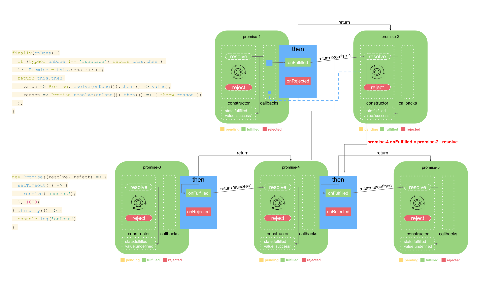

# 图解 Promise 实现原理（三）—— Promise 原型方法实现

## 摘要

很多同学在学习 Promise 时，知其然却不知其所以然，对其中的用法理解不了。**本系列文章由浅入深逐步实现 Promise，并结合流程图、实例以及动画进行演示，达到深刻理解 Promise 用法的目的。**

1. [图解 Promise 实现原理（一）—— 基础实现](../chapter01/README.md)
2. [图解 Promise 实现原理（二）—— Promise 链式调用](../chapter02/README.md)
3. [图解 Promise 实现原理（三）—— Promise 原型方法实现](./README.md)
4. [图解 Promise 实现原理（四）—— Promise 静态方法实现](../chapter04/README.md)

## 前言

上一节中，实现了 Promise 的链式调用。链式调用是 Promise 的难点，更是重点。截至目前，Promise 的实现如下：

```js
class Promise {
    callbacks = [];
    state = 'pending';//增加状态
    value = null;//保存结果
    constructor(fn) {
        fn(this._resolve.bind(this));
    }
    then(onFulfilled) {
        return new Promise(resolve => {
            this._handle({
                onFulfilled: onFulfilled || null,
                resolve: resolve
            });
        });
    }
    _handle(callback) {
        if (this.state === 'pending') {
            this.callbacks.push(callback);
            return;
        }
        //如果then中没有传递任何东西
        if (!callback.onFulfilled) {
            callback.resolve(this.value);
            return;
        }
        var ret = callback.onFulfilled(this.value);
        callback.resolve(ret);
    }
    _resolve(value) {
        if (value && (typeof value === 'object' || typeof value === 'function')) {
            var then = value.then;
            if (typeof then === 'function') {
                then.call(value, this._resolve.bind(this));
                return;
            }
        }
        this.state = 'fulfilled';//改变状态
        this.value = value;//保存结果
        this.callbacks.forEach(callback => this._handle(callback));
    }
}
```

本节主要介绍 Promise 原型方法的实现，包括 catch、finally 以及 rejected 状态等的实现。

## 错误处理

之前为了讲解原理，只是实现了 onFulfilled ，对于 Promise 来说，除了成功还有失败，在失败时，要标记 Promise 的状态为 rejected， 并执行注册的 onRejected。如下Demo所示:

```js
/**
 * 模拟异常异步请求
 * @param {*} url 
 * @param {*} s 
 * @param {*} callback 
 */
const mockAjax = (url, s, callback) => {
  setTimeout(() => {
    callback(url + '异步请求耗时' + s + '秒', '出错了!');
  }, 1000 * s)
}

//demo reject
new Promise((resolve, reject) => {

    mockAjax('getUserId', 1, function (result, error) {
        if (error) {
            reject(error)
        } else {
            resolve(result);
        }
    })

}).then(result => {
    console.log(result);
}, error => {
    console.log(error);
});
```

有了之前处理 fulfilled 状态的经验，支持错误处理变得很容易，只需要在注册回调、处理状态变更上都要加入新的 reject 逻辑。

```js
//完整的实现+reject
class Promise {
    callbacks = [];
    state = 'pending';//增加状态
    value = null;//保存结果
    constructor(fn) {
        fn(this._resolve.bind(this), this._reject.bind(this));
    }
    then(onFulfilled, onRejected) {
        return new Promise((resolve, reject) => {
            this._handle({
                onFulfilled: onFulfilled || null,
                onRejected: onRejected || null,
                resolve: resolve,
                reject: reject
            });
        });
    }
    _handle(callback) {
        if (this.state === 'pending') {
            this.callbacks.push(callback);
            return;
        }

        let cb = this.state === 'fulfilled' ? callback.onFulfilled : callback.onRejected;

        if (!cb) {//如果then中没有传递任何东西
            cb = this.state === 'fulfilled' ? callback.resolve : callback.reject;
            cb(this.value);
            return;
        }

        let ret = cb(this.value);
        cb = this.state === 'fulfilled' ? callback.resolve : callback.reject;
        cb(ret);
    }
    _resolve(value) {

        if (value && (typeof value === 'object' || typeof value === 'function')) {
            var then = value.then;
            if (typeof then === 'function') {
                then.call(value, this._resolve.bind(this), this._reject.bind(this));
                return;
            }
        }

        this.state = 'fulfilled';//改变状态
        this.value = value;//保存结果
        this.callbacks.forEach(callback => this._handle(callback));
    }
    _reject(error) {
        this.state = 'rejected';
        this.value = error;
        this.callbacks.forEach(callback => this._handle(callback));
    }
}
```

[demo-reject的源码](https://repl.it/@morrain2016/demo-reject)

运行结果如下：

```
[Promse-1]:constructor
[Promse-1]:then
[Promse-2]:constructor
[Promse-1]:_handle state= pending
[Promse-1]:_handle callbacks= [ { onFulfilled: [Function],
    onRejected: [Function],
    resolve: [Function],
    reject: [Function] } ]
=> Promise { callbacks: [], name: 'Promse-2', state: 'pending', value: null }
[Promse-1]:_reject
[Promse-1]:_reject value= 出错了!
[Promse-1]:_handle state= rejected
出错了!
[Promse-2]:_reject
[Promse-2]:_reject value= undefined
```

## 异常处理

刚刚介绍了错误处理，是指在 Promise 的构造函数中发现的错误，并通过 reject 通知的。如果在执行 onFulfilled 或者 onRejected 时，出现了异常，该如何处理呢？对于这类异常，处理也很简单，可以使用 try-catch 捕获错误，然后将相应的 Promise 状态设置为 rejected 状态。改造_handle方法如下：

```js
_handle(callback) {
        if (this.state === 'pending') {
            this.callbacks.push(callback);
            return;
        }

        let cb = this.state === 'fulfilled' ? callback.onFulfilled : callback.onRejected;

        if (!cb) {//如果then中没有传递任何东西
            cb = this.state === 'fulfilled' ? callback.resolve : callback.reject;
            cb(this.value);
            return;
        }

        let ret;

        try {
            ret = cb(this.value);
            cb = this.state === 'fulfilled' ? callback.resolve : callback.reject;
        } catch (error) {
            ret = error;
            cb = callback.reject
        } finally {
            cb(ret);
        }

    }
```

[demo-error的源码](https://repl.it/@morrain2016/demo-error)

不管是错误也好，异常也罢，最终都是通过 reject 实现的，可见最终对于错误以及异常的处理，都可以通过 then 中的 onRejected 来处理。所以单独增加一个 catch 方法，它是 .then(null, onRejected) 的别名。如下：

```js
   then(onFulfilled, onRejected) {
        return new Promise((resolve, reject) => {
            this._handle({
                onFulfilled: onFulfilled || null,
                onRejected: onRejected || null,
                resolve: resolve,
                reject: reject
            });
        });
    }
    catch(onError){
      return this.then(null, onError);
    }
```

[demo-catch的源码](https://repl.it/@morrain2016/demo-catch)

## Finally方法

在实际应用的时候，我们很容易会碰到这样的场景，不管 Promise 最后的状态如何，都要执行某些操作(onDone)。例如服务器使用 Promise 处理请求，然后使用finally方法关掉服务器:

```js
server.listen(port)
.then(function () {
    // do something
 })
.catch(error=>{
    // handle error
})
.finally(server.stop);
```

本质上，因为它是 then 的一种变形。上面的 demo 的效果等价于如下的代码：

```js
server.listen(port)
  .then(function () {
    // do something
  })
.catch(error=>{
    // handle error
})
.then(server.stop, server.stop);
```

通过上面的分析，finally看上去可以这么实现：

```js
finally(onDone){
    return this.then(onDone, onDone);
}
```

但是由于 finally 方法的 onDone 不关心 Promise 的状态到底是 fulfilled 还是 rejected ，所以onDone 里的操作，应该是与状态无关的，并且不应该有任何参数。

如果使用 then 来实现就不符合 Promise 规范中关于《[Why not .then(f, f)?](https://github.com/tc39/proposal-promise-finally#why-not-thenf-f)》的说明 。一来 onDone 有参数，二来当 onDone 返回一个Promise时，会改变 finally 返回的Promise的值 状态 。

根据规范，finally实现如下：

```js
  catch(onError) {
    return this.then(null, onError);
  }
  finally(onDone) {
    if (typeof onDone !== 'function') return this.then();
    let Promise = this.constructor;
    return this.then(
      value => Promise.resolve(onDone()).then(() => value),
      reason => Promise.resolve(onDone()).then(() => { throw reason })
    );
  }
```

> 其中 Promise.resolve 为下一章节中要讲述的内容

[demo-finally的源码](https://repl.it/@morrain2016/demo-finally)

```js
new Promise((resolve, reject) => {
  setTimeout(() => {
    resolve('success');
  }, 1000)
}).finally(() => {
  console.log('onDone')
})
```

对于上面的示例，执行结果如下：

```
[Promse-1]:constructor
[Promse-1]:finally
[Promse-1]:then
[Promse-2]:constructor
[Promse-1]:_handle state= pending
[Promse-1]:_handle callbacks= [ { onFulfilled: [Function],
    onRejected: [Function],
    resolve: [Function],
    reject: [Function] } ]
=> Promise { callbacks: [], name: 'Promse-2', state: 'pending', value: null }
[Promse-1]:_resolve
[Promse-1]:_resolve value= success
[Promse-1]:_handle state= fulfilled
onDone
Promise::resolve
[Promse-3]:constructor
[Promse-3]:_resolve
[Promse-3]:_resolve value= undefined
[Promse-3]:then
[Promse-4]:constructor
[Promse-3]:_handle state= fulfilled
[Promse-4]:_resolve
[Promse-4]:_resolve value= success
[Promse-2]:_resolve
[Promse-2]:_resolve value= Promise {
  callbacks: [],
  name: 'Promse-4',
  state: 'fulfilled',
  value: 'success' }
[Promse-4]:then
[Promse-5]:constructor
[Promse-4]:_handle state= fulfilled
[Promse-2]:_resolve
[Promse-2]:_resolve value= success
[Promse-5]:_resolve
[Promse-5]:_resolve value= undefined
```

同样可以通过示意动画来还原这个过程：

<video id="video" controls="" preload>
      <source id="mov" src="./img/Promise.finally.mov" type="video/mp4">
      <p>Your user agent does not support the HTML5 Video element.</p>
</video>

finally 的实现看起来简单，实际理解还是比较困难，对于上面的实例，中间其实有5个 Promise实例生成。如下图所示：



原型方法就介绍这么多，下一节介绍两个静态方法